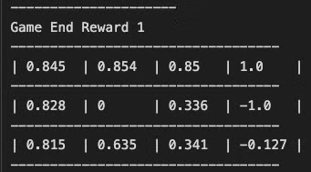
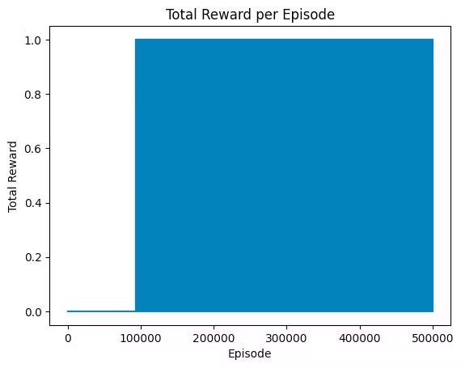
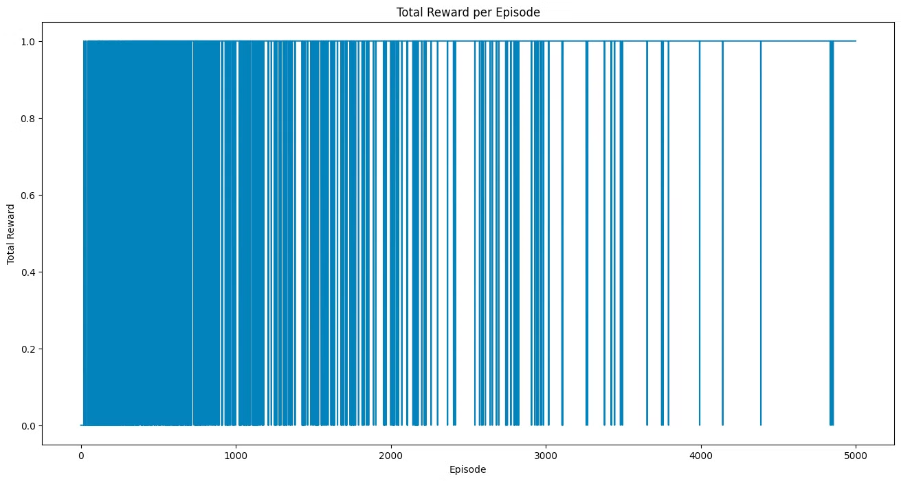
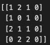

# RL_learning

## Random Agent on CartPole v0
Here I implemented a random agent on the Cart Pole problem using Open AI Gymnasium. You can see the video demo at this link: https://youtu.be/ANO1di9qgEo

## Grid World
Here I tried to implement a basic grid world from scratch (no libraries >_<). This was quite challenging but I found a useful tutorial here: https://towardsdatascience.com/reinforcement-learning-implement-grid-world-from-scratch-c5963765ebff

## Temporal Difference on Frozen Lake v1
Here I implemented Temporal Different Policy Evaluation using epsilon-greedy as my policy on the Frozen Lake environment using Open AI Gymnasium. Here is the video demo:
https://youtu.be/BuruySqLlak

After 500k episodes, here was the observed total reward per episode:

From this graph, we can see that it’s not yet converging but it’s starting too (just very slowly). This is likely because we’re working a sparse reward environment (ie. the agent is only rewarded when they reach the treasure). Also doing TD(0) might not be the optimal method in this case. Something like Dynamic Programming (ie. Q-Learning) I think will work work better

## Q-Learning on Frozen Lake v1
The results with Q-Learning are much more promising!

In the graph above, it’s clear that the agent start learning within 100 episodes and by the 3000 episode mark, it’s consistently getting the reward :)

